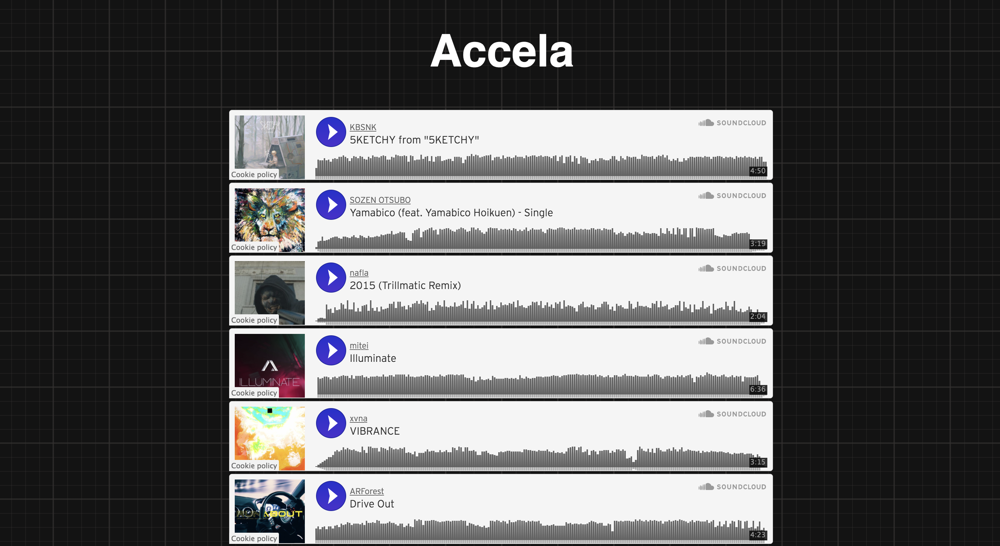
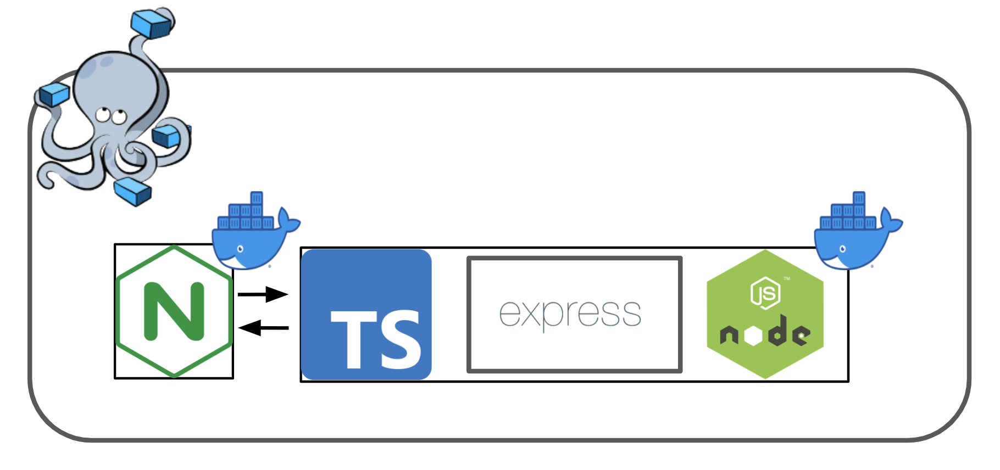

# Accela



## Overview

Accela helps users look for new songs in SoundCloud. 

## Getting Started

### 1. Docker image preparation
- Build docker images via

```
$ bash build.sh
```
 
### 2. Start Cyberia
- Start application via the command below and access 0.0.0.0:5000. It will take a long time to start first page.

```
$ docker-compose up -d
```

## User Guide

- Like playlists, next songs are automatically played after previous songs finish. When the final song is over, the first song starts to play.
- If you push `n`, the next song starts to play. If you push `p`, the previous song starts to play.

## System Configuration


